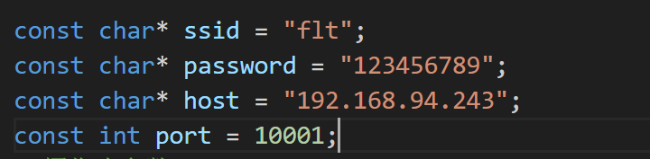

本项目使用java和ESP32-CAM通过TCP协议传输数据实现的远程监控项目。 

将ESP32拍到的照片不断在java上刷新显示实现的监控功能，视频帧率大概在10左右。

 由于电脑防火墙的原因，本项目在局域网内实现。如要在广域网中实现需将java服务端做内网穿透。

java程序开发使用的是开发环境是 IJ IDEA。ESP32使用的是VSCode中内置的Platformio开发。

一下为使用的ESP32-CAM开发板照片

# 使用方法：

1. 运行java服务端时，打开 Camera_Server_java\ESP\src\ESP\Server 文件路劲下的pictureServer.java文件运行
2. ESP32-CAM的代码在Camera_Monitoring_ESP文件中，其中main.cpp文件在src文件夹下。
3. 运行时要确保java服务端和ESP32-CAM连接的wifi在同一局域网下。
4. 可在ESP32-CAM的代码中修改要连接的wifi名称和密码以及TCP服务端的IP地址和端口。
5. **需注意ESP32不支持5G信号连接，连接手机热点时，要将手机的热点信号调成==2.4GHz频段==的**。

